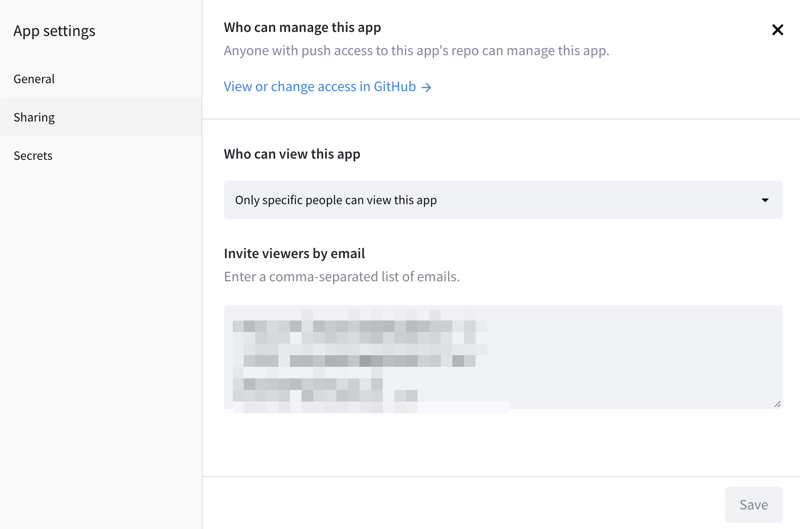

# An interactive visualization app for SBTN step 1 and 2
## Background    
The Science based target network (SBTN)
framework, which is an existing protocol for measuring and alleviate environmental impacts of a global supply chain, designed to guide companies in the development of measurable, actionable, and time-bound objectives, based on the best available science. The goal is to align companies’ activities with Earth’s limits and societal sustainability goals. It’s existing protocols that equip companies with guidance to build on what companies have already done for sustainable development; provide strategies on what needs to be improved. The general steps of SBTN includes assess, interpret & prioritize, disclose, act and track.    

The purpose of developing this app (tool) is for exploratory data analysis. The exploratory data analysis approach will be developed to allow the tool to support the implementation of the SBTN framework. Interactive visualization techniques will be used and allow the integration and aggregation of various biodiversity and environmental index, while ideally already applying it in an ongoing project. As it is developed, we will receive feedback from the consultants and clients, to improve the final product.

## App design and instructions     
The app covers 4 pages. Introduction, preliminary exploration page, bar view page and map view page.     

### Inviting people to view the app 
The app is not a public app, which means it can only be viewed by specific people. Entering the people's email addresses in the App settings - Sharing tab. Then the user will recieve an invitation link to view the app.  

  

### Introduction page    
**Introduction page** is designed for locating your data via a combination of two codes: unique sheet code and work sheet name. Unique sheet code is written in the .toml file, which is the secret of this app, can be accessed by developer, detail can be found in the figure below:    

    

The combination of two codes ensure the data security that avoiding users seeing each other's dataset. The two codes shall be provided by the developer. The users need to ensure they have the user access to the app first.        

If another dataset needs to be added, please make sure to enter the datasheet's information in the secrets (.toml file when testing in the local environment, but make sure not to git push the .toml file while updating the app). Also the datasheet needs to grant the permission to Streamlit app. (see practical walkthrough slides if you have it) 

Once the user click the submit bottom, the data is loaded to Introduction page and all the other 3 pages. The user can refresh the Introduction page to re-enter the two codes to load another dataset. 

### Priliminary exploration page   
The user can preview the first line of the loaded dataset in each page. In the dropdown menus, columns of the datasheet are selected to generate the plots. Note that in every frame of the analysis, a picture is presented in the front to demonstrate an expected outcome or a brief instruction of how to select in the drop down menus. Explore as you like. 

A demonstration can be found below (if using the demo dataset, two codes: gsheets4, sub_demo_df Note that all the demonstrations below are made by this dataset).

The first frame is for an overall exploration on single impact. The second frame is for a breakdown exploration on single impact, but the proportion can be detailed at a smaller commodity level.  

   

### Bar view page
The selected impacts will be shown as bars in the output. Note that the selection of tree-filtering needs be to in orders. For example Category_L1 is the largest class, while the Category_L4 is the samllest, then the selections can be `Category_L1, Category_L2, Category_L3` or `Category_L1, Category_L4` or `Category_L3, Category_L4` or ... Also single selection is supported. You can choose only one Category here. 

Bar view allows a tree-structured filtering frame, help user to see the impacts aggregated by commodities from different levels. 

 

### Map view page   
A demonstrated selections can be found blow. The map will be colored by SBTN water pollution, which is indicated in the global scale section, grouped by country level with mean. Then the impacts and commodity category indicated in the local scale section will be presented in the pop-up window of each country, showing the area-specfic information of selected impacts aggregated by selected category. 

## Instruction video
